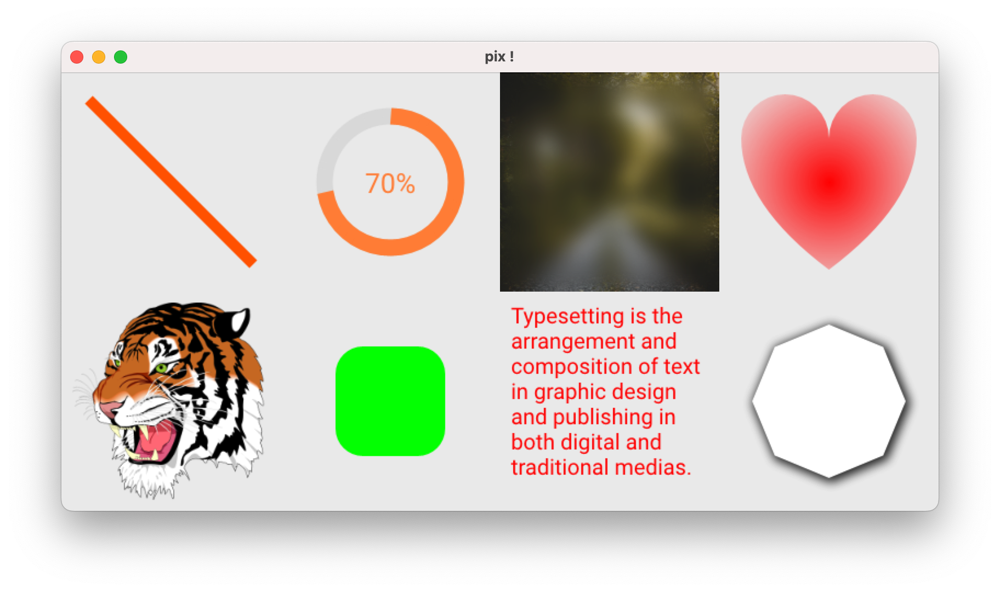

pix - 2D graphics library
================
Tcl/Tk wrapper around [Pixie](https://github.com/treeform/pixie), a full-featured 2D graphics library written in Nim.


Compatibility :
-------------------------
- Tcl/Tk 8.6 & 9.0

Platforms :
-------------------------
- MacOS (x64 / arm64)
- Windows x64
- Linux x64

Source distributions and binary packages can be downloaded [here](https://github.com/nico-robert/pix/releases).

Example :
-------------------------
```tcl
package require pix

# Init 'context' with size + color.
set ctx [pix::ctx::new {200 200} "white"]

# Style first rectangle.
pix::ctx::fillStyle $ctx "rgb(0, 0, 255)" ; # blue color
pix::ctx::fillRect $ctx {10 10} {100 100}

# Style second rectangle.
pix::ctx::fillStyle $ctx "rgba(255, 0, 0, 0.5)" ; # red color with alpha 50%
pix::ctx::fillRect $ctx {50 50} {100 100}

# Save context in a image file (*.png|*.bmp|*.qoi|*.ppm)
pix::ctx::writeFile $ctx rectangle.png

# Or display in label by example :
set p [image create photo]
pix::drawSurface $ctx $p
label .l -image $p
pack .l
```
See **[examples folder](/examples)** for more demos.

Documentation :
-------------------------
A large part of the `pix` [documentation](http://htmlpreview.github.io/?https://github.com/nico-robert/pix/blob/master/doc/pix.html) comes from the [Pixie API](https://treeform.github.io/pixie/) and source files. 

#### Currently API tested and supported are :
| API        | Description
| ------     | ------
| _context_  | This namespace provides a 2D API commonly used on the web.
| _font_     | This namespace allows you to write text, load fonts.
| _image_    | Crop, resize, blur image and much more.
| _paint_    | This namespace plays with colors.
| _path_     | Vector Paths.
| _svg_      | Parse, render SVG (namespace pretty limited)

Acknowledgments :
-------------------------
- [tclstubs-nimble](https://github.com/mpcjanssen/tclstubs-nimble) (MIT)
- [Pixie](https://github.com/treeform/pixie) (MIT)

License :
-------------------------
**pix** is covered under the terms of the [MIT](LICENSE) license.

Release :
-------------------------
*  **03-Jun-2024** : 0.1
    - Initial release.
*  **25-Jun-2024** : 0.2
    - Add `font` namespace + test file.
    - Add `image` namespace + test file.
    - Add `paint` namespace + test file.
    - Add `path` namespace + test file.
    - Rename `pix::ctx::getSize` by `pix::ctx::get` 
    - Rename `pix::img::read` by `pix::img::readImage`
    - Rename `pix::font::read` by `pix::font::readFont`
    - Add documentation based on Pixie API reference.
    - Add binary for Linux.
    - Code refactoring.
*  **06-Oct-2024** : 0.3
    - Doc : Jpeg format is not supported for pix::ctx::writeFile.
    - Rename `pix::parsePath` to `pix::pathObjToString`
    - Add `pix::svgStyleToPathObj` proc (convert SVG path string to path object)
    - Add `pix::rotMatrix` proc (matrix rotation)
    - Fix bug `pix::path::fillOverlaps` bad arguments, used.
    - Code refactoring.
*  **02-Mar-2025** : 0.4
    - Support for `Tcl/Tk9`.
    - Adds binary for MacOS `arm64`.
    - Adds `X11` for purpose testing.
    - Code refactoring ++.
