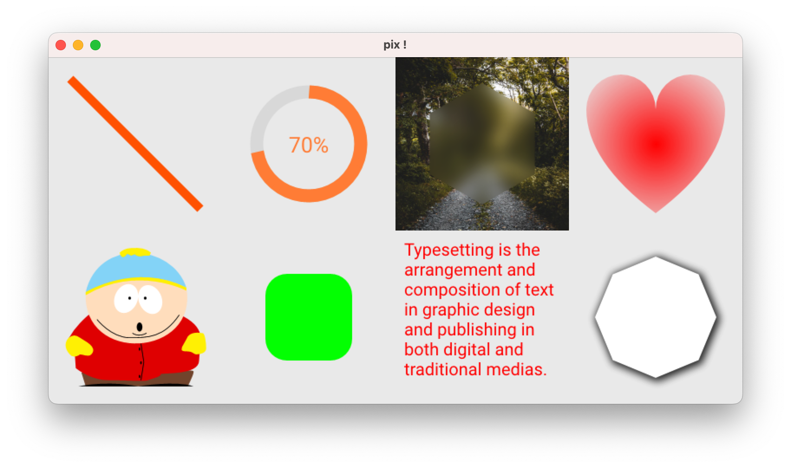

pix - 2D graphics library
================
Tcl/Tk wrapper around [Pixie](https://github.com/treeform/pixie), a full-featured 2D graphics library written in Nim.


Compatibility :
-------------------------
- This package requires **Tcl/Tk 8.6** or later (Only tested with Tcl/Tk _8.6.14_).

Platforms :
-------------------------
- MacOS 14.4 x64
- Windows 10

> [!NOTE]  
> - Linux should work, but I don't have a system to test it on.   

Example :
-------------------------
```tcl
package require pix

# Init 'context' with size + color.
set ctx [pix::ctx::new {200 200} "white"]

# Style first rectangle.
pix::ctx::fillStyle $ctx "rgba(0, 0, 255, 0.5)" ; # blue
pix::ctx::fillRect $ctx {10 10} {100 100}

# Style second rectangle.
pix::ctx::fillStyle $ctx "rgba(255, 0, 0, 0.5)" ; # red
pix::ctx::fillRect $ctx {50 50} {100 100}

# Save context in a file (*.png|*.bmp|*.jpeg|*.qoi|*.ppm)
pix::ctx::writeFile $ctx rectangle.png

# Or display in label by example
set p [image create photo]
pix::drawSurface $ctx $p
label .l -image $p ; pack .l
```
See **[examples folder](/examples)** for more demos.

Documentation :
-------------------------
Not really... But for `Pixie` there is this [one](https://treeform.github.io/pixie/).

#### Currently options tested and supported are :
- [x] context
- [ ] font (Partially)
- [ ] image (Partially)
- [ ] paint
- [ ] paths
- [ ] svg (Partially)

Inspiration :
-------------------------
- [tclstubs-nimble](https://github.com/mpcjanssen/tclstubs-nimble)

License :
-------------------------
**pix** is covered under the terms of the [MIT](LICENSE) license.

Release :
-------------------------
*  **03-Jun-2024** : 0.1
    - Initial release.